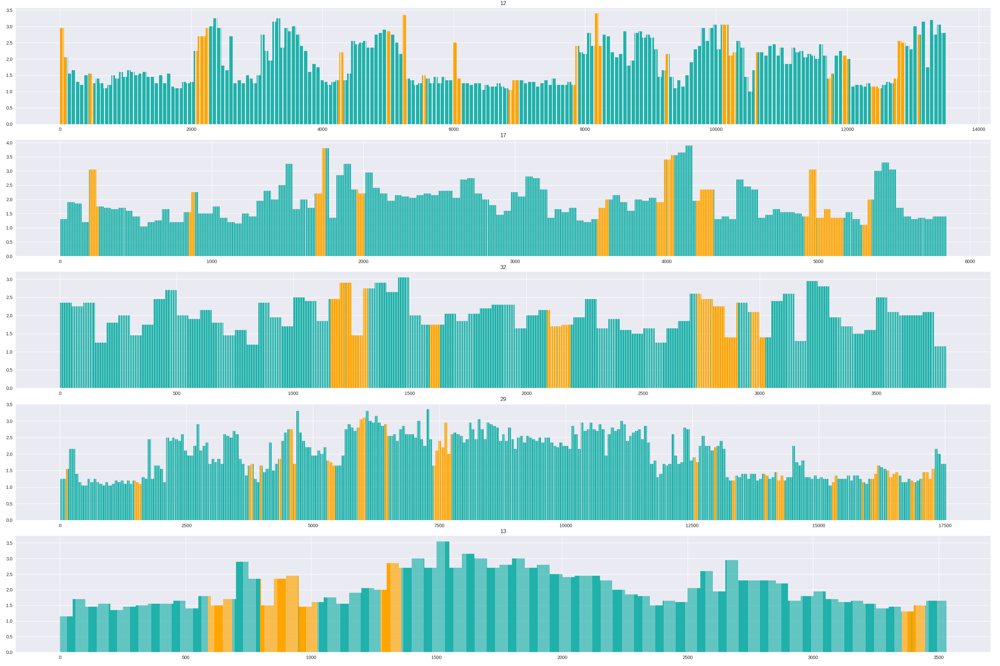

# Video_Summary_using_FCSN
A PyTorch reimplementation of FCSN in paper "Video Summarization Using Fully Convolutional Sequence Networks".

## Paper Publication Info
Mrigank Rochan, Linwei Ye, and Yang Wang. <br>
Video Summarization Using Fully Convolutional Networks. <br>
*European Conference on Computer Vision (ECCV)*, 2018   

pdf link: http://openaccess.thecvf.com/content_ECCV_2018/papers/Mrigank_Rochan_Video_Summarization_Using_ECCV_2018_paper.pdf

## Dataset

A TVSum dataset (downsampled to 320 frames per video) preprocessed by `make_dataset.py` is available [here](https://drive.google.com/open?id=1BZyUAosqOQeSRhP0HCezC01bwc7A-nJp). There are 50 groups in this hdf5 file named `video_1` to `video_50` . Datasets in each group is as follows:

| name  | description |
| :-------: | :----------------------------: |
| `length`  | scalar, number of video frames |
| `feature` |       shape (320, 1024)        |
|  `label`  |          shape (320, )         |
| `change_points` | shape (n_segments, 2) <br>stores begin and end of each segment |
| `n_frame_per_seg` | shape (n_segments, ) <br>number of frames in each segment |
| `user_summary` | shape (20, length) <br>summary from 20 users, each row is a binary vector |

## Train

First change the `data_path` in `config.py` to your own hdf5 data path. Then run

```shell
python train.py
```

Every 5 epoch, model parameters and predicted summaries will be saved in save_dir and score_dir respectively. Evaluation result (precision, recall and f-score) will be printed at the same time.

## Generate Summary

To generate keyframes (images) and keyshots (video), run

```shell
python gen_summary.py --h5_path {your hdf5 dataset path} --json_path {json file path saved in score_dir} --data_root {root dir of tvsum dataset} --save_dir {where to save the generating summary} --bar
```

preview of score-bar (x-axis: frame index, y-axis: user's score, and columns in orange is selected keyshots):


